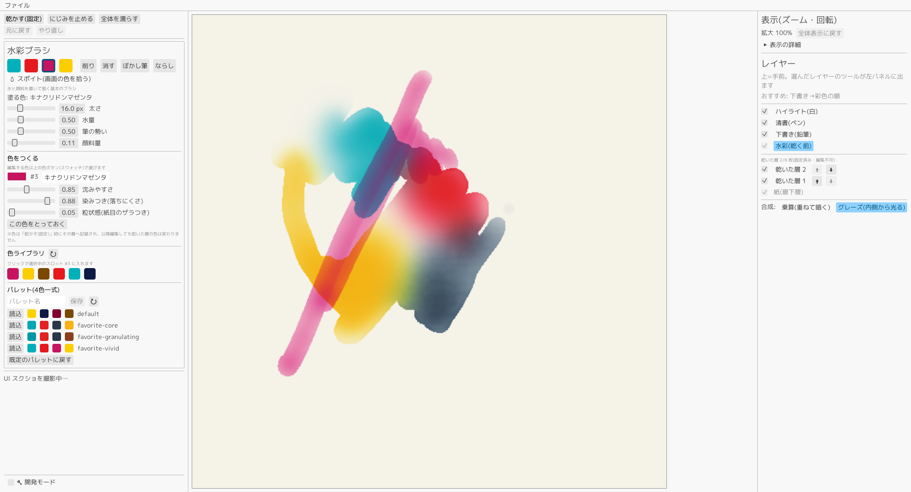

# かさねいろ(kasaneiro)

自分用のお絵描きツールです。水彩らしいにじみ・混色・透けのような表現をしやすくするための機能を実装しています。

<p align="center">
  
</p>

## コア要件(3つ)

1. **wet-on-wet** — 先に置いた色の近くに別の色で描くと、馴染んで綺麗なグラデーションになる(黄+青が濁らず緑に馴染むのが判定基準)
2. **グレージング** — 乾いた色の上に別の色を描くと、下の層が動かず、重なりが透けて見える(Kubelka-Munk の光学合成)
3. **削り** — リフト(再湿潤して顔料を浮かせる。ステイニングの強い顔料は紙に色が残る)+完全消去の2ツール構成

## 主な機能

- 水の流体シミュレーション(Curtis 1997 簡略版)+ mixbox による物理ベース混色
- 紙の凹凸(紙ハイト)がにじみの前線・粒状感に表情を与える
- 下書き鉛筆 → 清書ペン → 彩色 → 白ハイライトのワークフロー(清書ペンの線は水の「土手」になり、はみ出しを防ぐ)
- ランタイム編集可能な4色パレット+色ライブラリ(顔料の色・沈みやすさ ρ・染みつき ω・粒状感 γ を編集して保存)
- レイヤー: 乾かす(焼き込み)/ Fast Dry / 再湿潤、乾燥レイヤーの並べ替え、レイヤーごとのパレット記録
- 作品保存(`works/*.kasane`。湿った絵の具ごと保存して翌日続きが描ける)/ PNG 書き出し
- キャンバス 512/1024/2048 選択式、パン・ズーム・回転、アクティブタイルによる濡れ面積比例の計算コスト
- 筆圧対応ペン(Windows Ink)、Undo/Redo(線画は多段・水彩は1段)
- WGSL ホットリロード・プリセット保存・ストローク記録再生など、パラメータ調整の反復を速くする装備一式(H1〜H6)

## ビルドと実行

Rust は [mise](https://mise.jdx.dev/) で管理している(`mise.toml`)。

```sh
mise exec -- cargo run        # 実行
cargo test --workspace        # テスト(workspace 構成なので --workspace 必須)
cargo clippy --workspace      # リント
```

workspace は `km`(Kubelka-Munk 純関数)・`pigment`(mixbox 混色)・`paint-core` の3クレート+ルートのバイナリクレートで構成。シェーダー(WGSL)は `assets/shaders/` から実行時ロードされ、保存すると即座にホットリロードされる。

## ドキュメント

| ドキュメント | 内容 |
|---|---|
| [docs/status.md](docs/status.md) | 現在の実装状況(正典) |
| [docs/requirements.md](docs/requirements.md) | 要件仕様 |
| [docs/architecture.md](docs/architecture.md) | 実装構造(モジュール・テクスチャ・パス順序・シェーダー) |
| [docs/parameters.md](docs/parameters.md) | 全パラメータと顔料個性 ρ/ω/γ のリファレンス |
| [docs/plan.md](docs/plan.md) | 実装計画(マイルストーン M0〜M8) |
| [docs/note/00-overview.md](docs/note/00-overview.md) | 技術調査ノートの起点 |

## ライセンスについて

混色に [mixbox](https://github.com/scrtwpns/mixbox)(CC BY-NC)を使用しているため、**非商用**。個人の道具として開発しており、配布・商用化は当面しない(商用化する場合は自作スペクトラル WGM へ差し替える計画 — docs/plan.md §4)。
